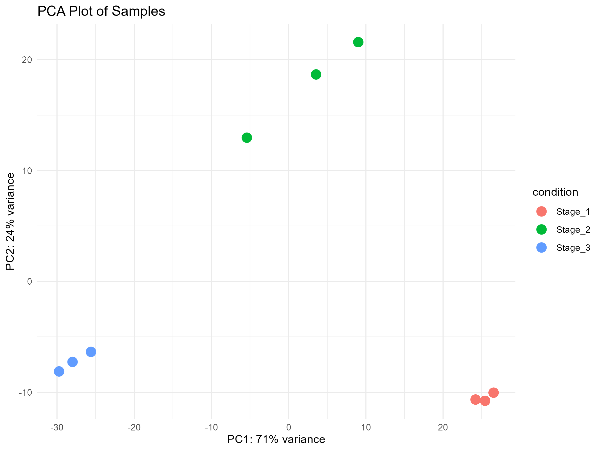
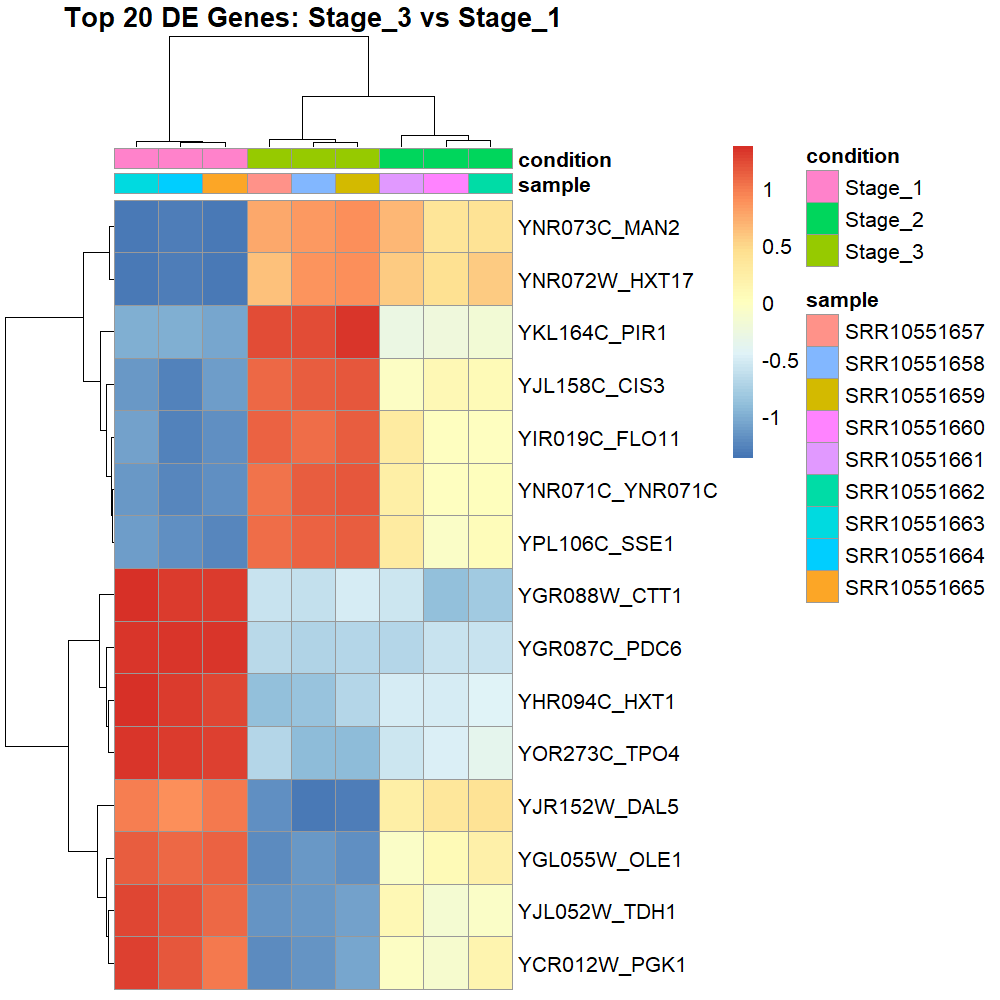
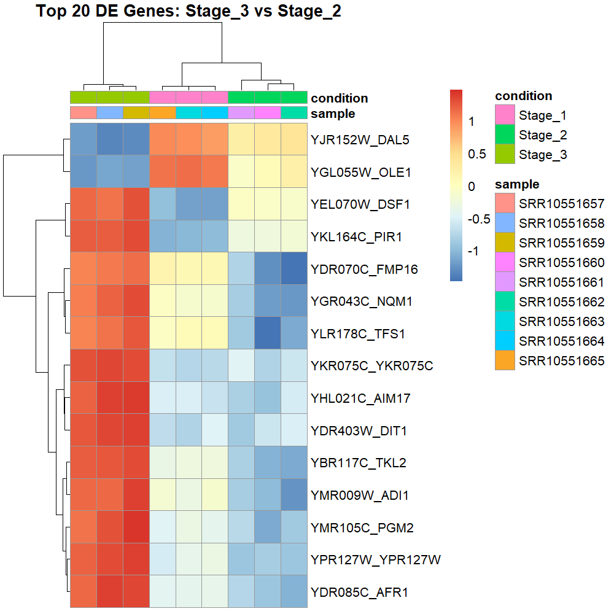
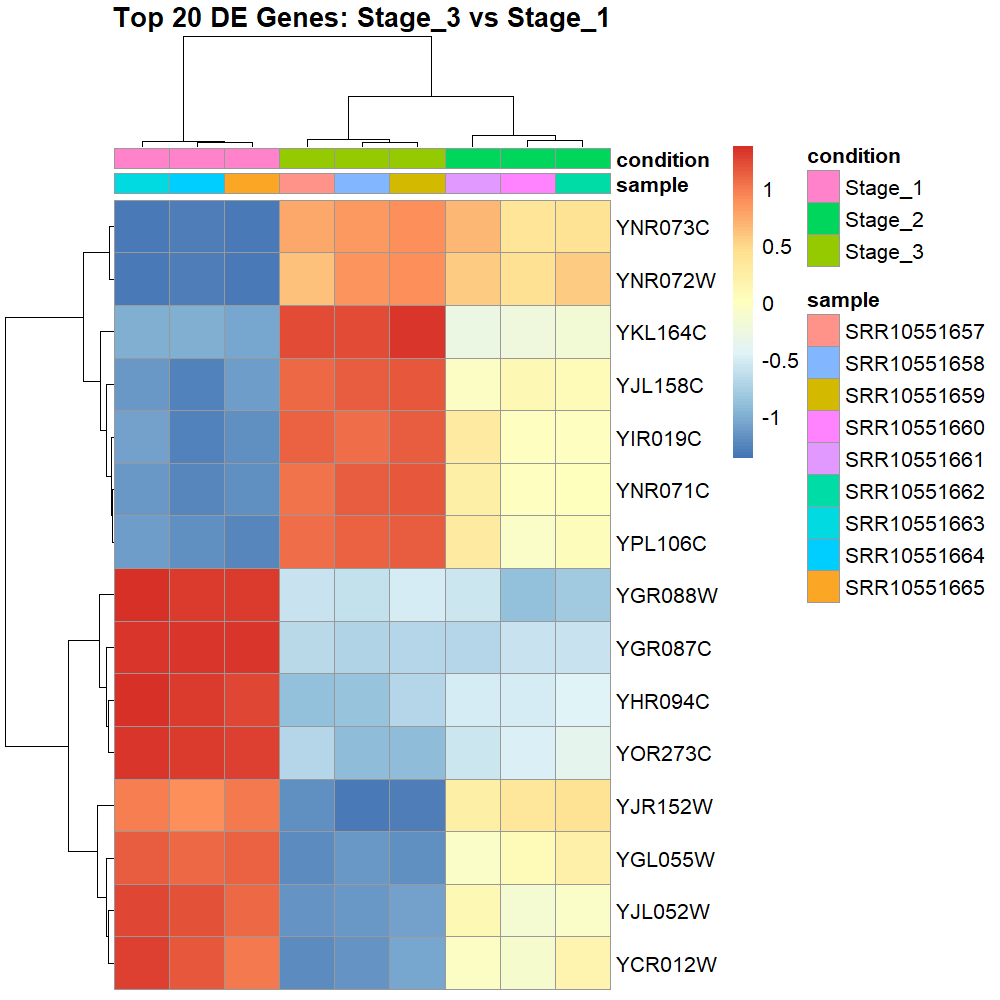
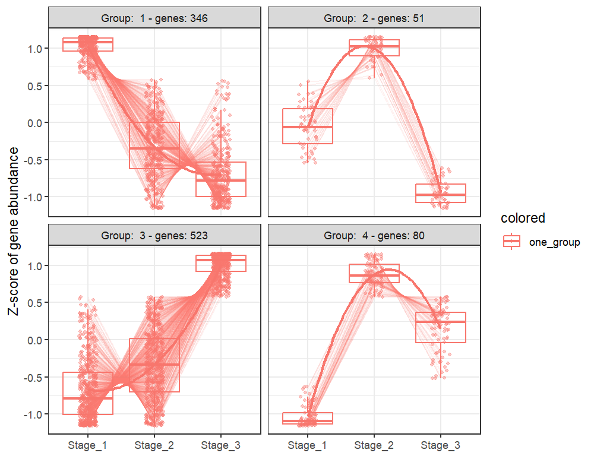
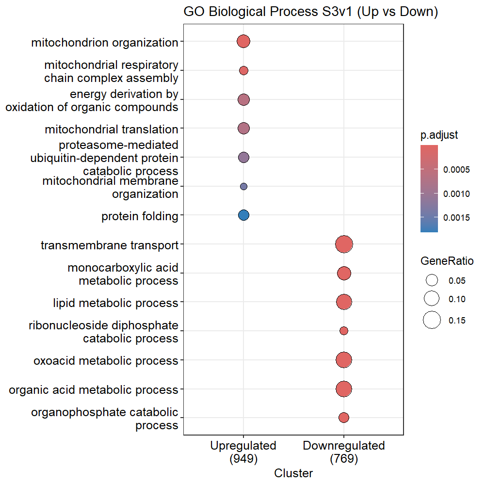
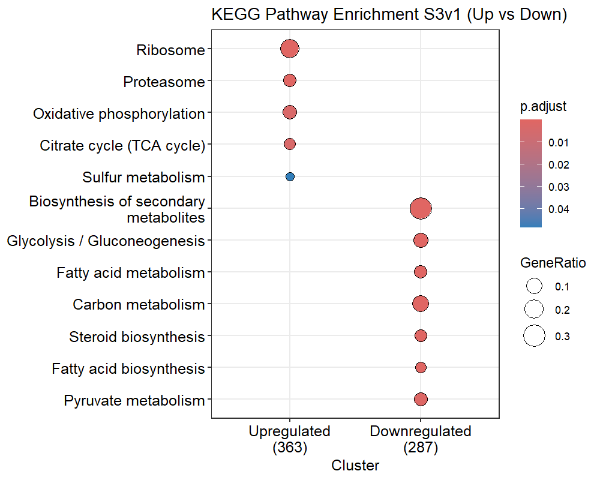
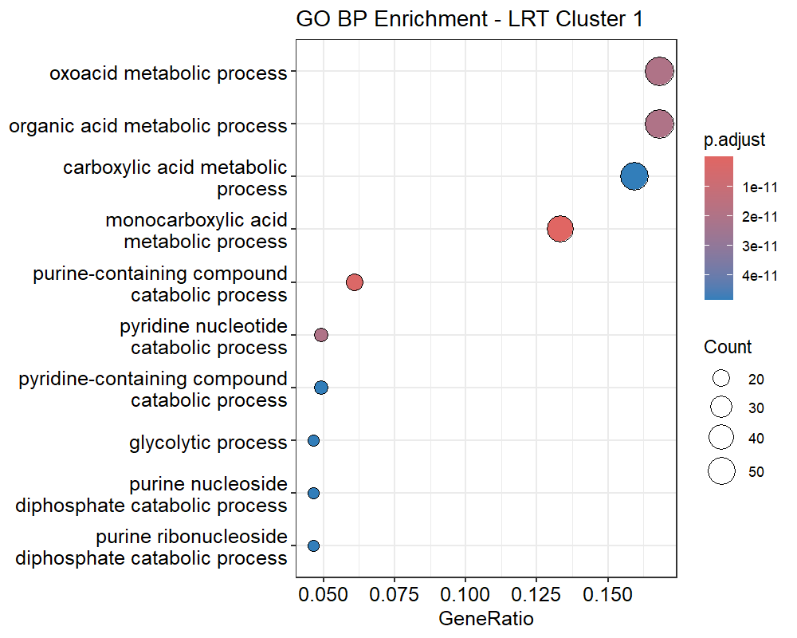
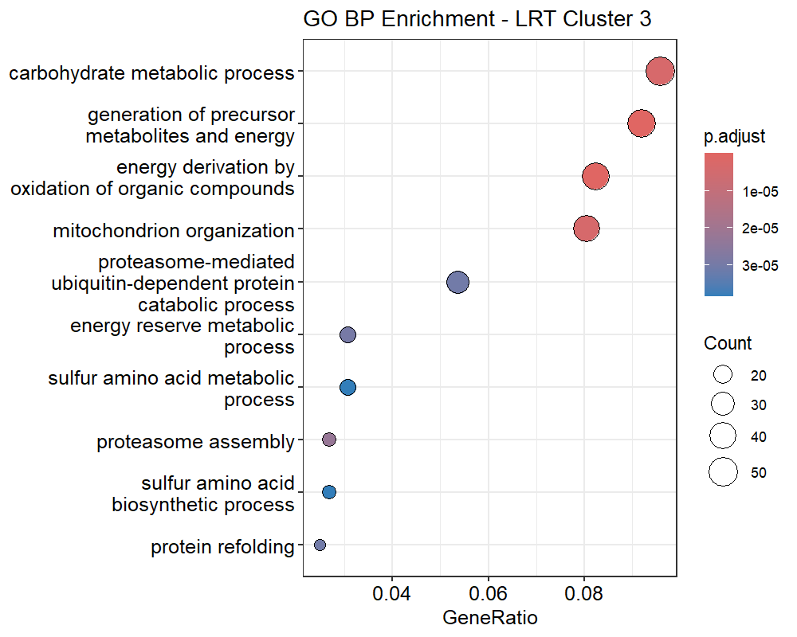

# Bulk Transcriptomic Analysis of Flor Yeast Velum Development 

## Introduction 
_Saccharomyces cerevisiae_, commonly known as brewer’s yeast, plays a central role in the production of sherry-style wines [1]. During biological wine aging, specialized flor yeast strains form a floating biofilm layer, referred to as a velum, on the surface of fortified wine [1]. This allows the yeast to survive oxidative stress and high ethanol levels that occur during aging. Unlike fermentative yeast strains, which rely primarily on sugars for energy, flor yeast utilizes ethanol and glycerol as carbon sources under oxidative stress, playing a part in both survival and the biochemical characteristics of sherry wines [1].

The dataset analyzed in this study is derived from a transcriptomic investigation of gene expression changes during a 71-day biological wine-aging process [1]. RNA-seq samples were collected at three distinct stages of velum development: Stage 1 (10 days, thin biofilm), Stage 2 (45 days, thin biofilm), and Stage 3 (71 days, mature biofilm). These stages reflect progressive biofilm maturation and physiological adaptation. Assessing gene expression changes across these time points helps identify regulatory mechanisms underlying stress responses, metabolic transitions, and biofilm structural development.

Transcriptomic analysis provides a comprehensive overview of global gene activity and enables investigation of changes in gene expression patterns in response to environmental and physiological stressors [2]. In the context of flor yeast, discovering these transcriptional changes is important for identifying pathways that facilitate oxidative adaptation and prolonged survival during wine aging.

The objective of this analysis is to evaluate differential gene expression across stages and identify biological processes and pathways associated with velum maturation. By using differential expression analysis with functional annotation, this analysis seeks to characterize the transcriptional mechanisms underlying flor yeast adaptation.

### Design Rationale 
Quality control was performed using `FastQC` on raw RNA-seq reads [3] in accordance with established RNA-seq best-practice guidelines [4]. This was to assess per-base sequence quality, GC content distribution, adapter contamination, overrepresented sequences, and duplication levels prior to downstream analysis.

Because transcript isoforms often overlap, short RNA-seq reads may originate from multiple transcripts, making accurate transcript-level quantification essential for reliable downstream analysis [5]. Alignment-free quantification tools such as `Salmon` [6], `Sailfish` [7], and `Kallisto` were evaluated. These methods are computationally efficient and achieve accuracy comparable to or better than that of traditional alignment-based approaches [5].

`Salmon` was selected over `Kallisto` and `Sailfish` because it incorporates more comprehensive bias-correction models (including sequence-specific, GC-content, and positional biases) and a probabilistic two-phase inference framework to improve transcript abundance estimation while maintaining comparable computational efficiency [7]. Additionally, `Salmon` integrates seamlessly with Bioconductor workflows through `tximport`, enabling accurate aggregation of transcript-level estimates to gene-level counts for differential analysis [8, 9].

Differential expression analysis was performed using `DESeq2` [10]. This was selected over `edgeR` [11] and `limma-voom` [12] because it models count data using a negative binomial distribution, which is appropriate for RNA-seq data [10, 13], and performs internal normalization of raw counts, simplifying the workflow. Wald tests were used for pairwise stage comparisons, and likelihood ratio tests (LRTs) were used to detect genes with significant expression changes across multiple stages [10].

To evaluate biological relevance, both over-representation analysis (ORA) and Gene Set Enrichment Analysis (GSEA) were conducted using `clusterProfiler` [14]. ORA identifies enriched Gene Ontology (GO) terms and KEGG pathways based on predefined lists of differentially expressed genes, whereas GSEA assesses enrichment across ranked gene lists without requiring an arbitrary cutoff, allowing detection of coordinated but subtle pathway-level changes [15]. While each statistical and enrichment method has limitations, such as including sensitivity to model assumptions and threshold selection, the combined use of complementary approaches strengthens confidence in the biological interpretation of flor yeast transcriptional regulation during biofilm maturation.

## Methods 
### 1.0 - Data and Tools
#### 1.1 - Containers
All command-line software used in this analysis was executed using containerized environments for reproducibility and version control. Singularity was used to pull pre-built Docker images and convert them into `.sif` container files stored in a dedicated `containers/` directory. 

#### 1.2 - Data Acquisition
The Flor yeast samples were obtained from the NCBI Sequence Read Archive (SRA) and correspond to the yeast biofilm (velum) development study described in [1]. The _Saccharomyces cerevisiae_ samples were collected at three stages of biofilm formation during wine aging:

* **Stage 1** (10 days) – SRR10551665, SRR10551664, SRR10551663
* **Stage 2** (45 days) – SRR10551662, SRR10551661, SRR10551660
* **Stage 3** (71 days) – SRR10551659, SRR10551658, SRR10551657

SRA files were retrieved using the prefetch command from the SRA Toolkit container. The script can be seen in [`01_data.sh`](scripts/01_data.sh).
These SRA files were then converted to FASTQ format using fasterq-dump. The script can be seen in [`02_data.sh`](scripts/02_data.sh). The resulting FASTQ files were compressed for use in downstream quality control and transcript quantification.

#### 1.3 - Reference Genome Reasoning
The RNA-seq data analyzed in this study originate from the _Saccharomyces cerevisiae L-329_ strain described in [1]. However, transcript quantification was performed using the _S288C_ reference transcriptome.

To validate this choice, [`00_refanalysis.sh`](scripts/00_refanalysis.sh) was used to assess sequence conservation between the _L-329_ [16] strain and the _S288C_ reference using BLAST. Results indicated that over 99% of queried sequences aligned to the _S288C_ reference [17], with an average percent identity of approximately 80%, supporting substantial conservation across coding regions.

Although _L-329_ is the experimental strain, _S288C_ was selected due to its well-annotated and curated genome assembly. Given the high alignment rate and strong sequence conservation, _S288C_ provides an appropriate and biologically relevant reference for transcript quantification and downstream functional enrichment analyses.

The _S288C_ transcript FASTA file was therefore used for downstream analysis.

### 2.0 - Quality Control with FastQC
All nine datasets were assessed for quality using `FastQC` version 3.2.1 [18], which was run within a containerized environment.

```
apptainer exec containers/fastqc.sif fastqc raw_data/*.fastq.gz -o fastqc_reports/ -t 8
```

Eight threads were used to improve computational efficiency. The full code can be seen in [`03_fastqc.sh`](scripts/03_fastqc.sh). All compressed `FASTQ` files located in the raw_data/ directory were analyzed, and output reports were written to the [`fastqc_reports`](fastqc_reports) directory. Per-base sequence quality, GC content distribution, sequence length distribution, and adapter contamination were evaluated for each sample [19]. After this evaluation, it was seen that all the samples demonstrated acceptable quality metrics and were used for downstream transcript quantification. 

### 3.0 - Quantification with salmon

Transcript-level abundance estimation was performed using `Salmon` version 1.10.3 in quasi-mapping mode within a containerized environment [20].

#### 3.1 - Transcript Index 
A transcriptome index was first generated from the _Saccharomyces cerevisiae S288C_ strain transcriptome (strain S288C). As mentioned, the FASTA file corresponding to the _S288C_ reference assembly was used for index construction:

```
apptainer exec containers/salmon.sif salmon index \
   -t raw_data/rna.fna \
   -i salmon_index \
   -k 31`
```
A k-mer size of 31 was used for index construction. This value was selected based on recommendations provided in the `Salmon` documentation [20], which suggests k = 31 as an appropriate default for accurate quasi-mapping performance. The index was saved to the `salmon_index` directory and used for all downstream quantification steps. This folder is not shown in the repository. The full code can be seen in [`04_salmon.sh`](scripts/04_salmon.sh).

#### 3.2 - Transcript Quantification 
Samples were automatically identified using SRR accession identifiers located within the raw_data/ directory (directory not shown in repository):

```
names=($(ls -d raw_data/SRR*/ | awk -F'/' '{print $2}'))`
```
Transcript quantification was then performed iteratively for each sample:

```
for i in "${names[@]}"
do
   apptainer exec containers/salmon.sif salmon quant \
       -i salmon_index \
       -l A \
       -r raw_data/${i}.fastq.gz \
       --validateMappings \
       -o salmon_output/${i}
done
```

Automatic library type detection, `-l A`, was enabled so `Salmon` could infer library orientation. The `--validateMappings` option was used to improve alignment specificity through selective alignment. All parameter choices were guided by recommendations in the `Salmon` documentation [20] to ensure an accurate transcript abundance estimation. The full code can be seen in [`05_salmon.sh`](scripts/05_salmon.sh).

For each sample, `Salmon` generated a quant.sf file containing transcript-level estimated counts, which can be found in the respective folders of the [`salmon_output`](salmon_output) directory. These files were subsequently imported into R using `tximport` for downstream differential expression analysis.

### 4.0 - Importing quant files with tximport

The quant.sf files generated in the previous step were imported into `RStudio` and summarized to gene-level counts using the `tximport` package [8]. This step converts transcript abundance estimates into gene-level counts, which are required for downstream differential expression analysis with `DESeq2`. The full code can be seen in [`06_setup.R`](scripts/06_setup.R).

All quant.sf files were stored in the [`salmon_output`](salmon_output) directory and linked to a sample metadata table describing the three velum developmental stages, with three biological replicates per stage. 

#### 4.1 - Gene Mapping

To summarize transcript-level estimates to the gene level, a transcript-to-gene mapping table, tx2gene, was created using the _Saccharomyces cerevisiae S288C_ gene annotation file `genomic.gtf` [16].

A `TxDb` object was generated using `makeTxDbFromGFF()` from the `GenomicFeatures` package [21], which allowed transcript IDs, TXNAME, to be matched to their corresponding `GENEID`. Minor naming inconsistencies were resolved by removing transcript version numbers to ensure compatibility.

#### 4.2 - Creating the DESeq2 object

Gene-level counts were generated using `tximport()` with parameters appropriate for `Salmon` output, including `ignoreTxVersion = TRUE,` as recommended in the Bioconductor vignette [8].
```
txi <- tximport(files,
                type = "salmon",
                tx2gene = tx2gene,
                ignoreTxVersion = TRUE)
```

The summarized counts were then used to construct a `DESeqDataSet` object using the design formula:

```
dds <- DESeqDataSetFromTximport(
  txi,
  colData = sample_table,
  design = ~ condition
)
```
The `DESeq2` object was saved for use in downstream differential expression and functional enrichment analyses.

### 5.0 - Differential Gene Expression Analysis

The previously constructed `DESeqDataSet` object was loaded and pre-filtered to remove low-count genes. This step reduces noise and improves statistical power. This design models how gene expression changes across the three developmental stages. For visualization purposes, a variance-stabilizing transformation (VST) was applied to normalized counts, `vsd`. The transformed data were used for PCA, clustering, and heatmap visualizations.
The full code is available in [`07_dexp_analysis.R`](scripts/07_dexp_analysis.R).

#### 5.1 - DESeq2: Wald Test
`DESeq2` implements the Wald Test to identify genes that are differentially expressed between specific developmental stages [10]. `DESeq2` models the RNA-Seq count data using a negative binomial framework and evaluates whether the estimated log2 fold change between two stages is significantly different from zero [10].

Analysis was performed for:

* Stage_2 (Thin) vs Stage_1 (Early)
* Stage_3 (Mature) vs Stage_1 (Early)
* Stage_3 (Mature) vs Stage_2 (Thin)

For Stage_2 vs Stage_1 and Stage_3 vs Stage_1, log2 fold changes were shrunk using the `apeglm` method to provide more stable and biologically meaningful effect size estimates. For Stage_3 vs Stage_2, standard contrast-based results were extracted.

Genes were considered significantly differentially expressed if they had:

* An adjusted p-value (padj) < 0.05
* An absolute log2 fold change > 1

#### Visualizations Performed

* **One Principal Component Analysis (PCA) plot** was generated using variance-stabilized data vsd to assess overall sample clustering by developmental stage (Early, Thin, Mature).
* **Volcano plots** were created for each stage comparison to visualize statistical significance and the magnitude of expression change.
* **Heatmaps** of the top differentially expressed genes were generated to examine expression patterns.
  
Visualizations can be viewed in the [`figures`](figures) directory.

#### 5.2 - DESeq2: Likelihood Ratio Test (LRT)
A likelihood ratio test (LRT) was performed to identify genes whose expression changed significantly across all developmental stages (Stage_1 – Early, Stage_2 – Thin, Stage_3 – Mature) [22]. Unlike the Wald test, which compares two stages at a time, the LRT evaluates whether gene expression varies across the entire experimental design. This was done by comparing a full model that included the condition term to a reduced model without it. Genes with an adjusted p-value (padj) < 0.05 were considered significantly stage-dependent. Significant genes were then clustered using variance-stabilized expression values to identify shared expression patterns across stages.

### 6.0 - Functional Enrichment Analysis 
Functional enrichment analysis was performed to interpret the biological significance of differentially expressed genes identified from both the Wald test and LRT clusters. All enrichment analyses were conducted using the `clusterProfiler` package with gene annotations from `org.Sc.sgd.db`. Enrichment of Wald test results was implemented in [`08_functional_analysis.R`](scripts/08_functional_analysis.R), while enrichment of LRT-derived gene clusters was performed separately in [`09_clusters.R`](scripts/09_clusters.R).

#### 6.1 - Over-representation Analysis (ORA): GO & KEGG 
ORA was performed using significantly differentially expressed genes from the Wald test (padj < 0.05 and |log2fold change| > 1). GO Biological Process and KEGG pathway enrichment were conducted using enrichGO() and enrichKEGG(). Results were visualized using dot plots.

For the LRT analysis, significant genes were clustered based on shared expression patterns (Section 5.2). ORA was then performed independently for each cluster in [`09_clusters.R`](scripts/09_clusters.R) to identify biological pathways.

#### 6.2 - Gene Set Enrichment Analysis (GSEA): GO & KEGG
GSEA was performed using ranked gene lists rather than applying a strict significance cutoff. For Wald results, genes were ranked by log2 fold change and analyzed using gseGO() and gseKEGG() in [`08_functional_analysis.R`](scripts/08_functional_analysis.R). For the LRT analysis, genes were ranked by the LRT test statistic, and GSEA was performed in [`09_clusters.R`](scripts/09_clusters.R) to identify pathways associated with overall stage-dependent expression changes. Enrichment results were visualized using dot plots and enrichment plots.

# Results
### FastQC 
<div align="center">

**Table 1.** Average sequencing quality metrics per developmental stage derived from FastQC reports. Complete quality control reports for all samples are available in the [`fastqc_reports`](fastqc_reports) directory.

| Stage   | Avg. Total Reads | Read Length (bp) | Avg. %GC |
|:--------|:----------------:|:----------------:|:--------:|
| Stage 1 | 7,053,566 | 50 | 43% |
| Stage 2 | 6,126,600 | 50 | 42% |
| Stage 3 | 8,236,044 | 50 | 42% |

</div>

Raw sequencing reads from Stage 1 (Early), Stage 2 (Thin), and Stage 3 (Mature) samples were assessed using FastQC prior to downstream analysis. Average sequencing depth ranged from 6.1 to 8.2 million reads per sample, with a consistent read length of 50 bp (Table 1). No reads were flagged as poor quality.

Per-base sequence quality passed for all samples, and no adapter contamination was detected. GC content was consistent across stages (42–43%) and between biological replicates. Although per-base sequence content and duplication levels were flagged in several samples, these patterns are commonly observed in RNA-seq data due to transcript abundance bias. Overall, sequencing quality was sufficient to proceed with alignment and differential expression analysis.

### Salmon Outputs
Transcript-level quantification was performed using Salmon against the Saccharomyces cerevisiae _S288C_ reference transcriptome. Mapping rates were consistently high across samples, averaging 85.47% for Stage 1, 81.17% for Stage 2, and 83.11% for Stage 3. Individual replicate mapping rates ranged from 74.2% to 92.3%. These high alignment rates indicate efficient assignment of reads to annotated transcripts and support the suitability of the S288C reference genome for this dataset. Overall, the strong mapping performance provides confidence in downstream transcript quantification and differential expression analysis.


### Differential Expression Analysis 
#### Wald Test Visualizations 
<div align="center">



**Figure 1.** Principal component analysis (PCA) of variance-stabilized counts across all developmental stages. PC1 explains 71% of the variance and separates Stage 1 from later stages, while PC2 explains 24% of the variance.

</div>

The first visualization performed for the differential gene analysis was the principal component analysis (PCA) for the three stages. Figure 1 revealed clear clustering among the three developmental stages. PC1 accounted for 71% of the variance and separated Stage 1, while PC2 explained 24% and distinguished Stage 2 from Stage 3. Biological replicates clustered closely within each condition, demonstrating high reproducibility and minimal technical variation.

<div align="center">


**Figure 2.** Volcano plot of differential expression analysis (Wald test) comparing Stage 3 and Stage 1. Red points represent significantly upregulated genes, blue points represent significantly downregulated genes, and gray points indicate non-significant genes.

</div>

The volcano plot comparing Stage 3 and Stage 1, shown in Figure 2, demonstrates transcriptional changes, with numerous genes significantly upregulated and downregulated. The points are approximately symmetric around zero, indicating comparable numbers of genes exhibiting positive and negative log2fold changes. Several genes exhibit large fold changes and strong statistical significance.

<br/>

<div align="center">

<table>
  <tr>
    <td align="center">
      <br>
      <sub><b>Figure 3A.</b> Stage 2 vs Stage 1</sub>
    </td>
    <td align="center">
      <br>
      <sub><b>Figure 3B.</b> Stage 3 vs Stage 2</sub>
    </td>
    <td align="center">
      <br>
      <sub><b>Figure 3C.</b> Stage 3 vs Stage 1</sub>
    </td>
  </tr>
</table>

<br>

<b>Figure 3.</b> Heatmaps of the top 15 differentially expressed genes identified in pairwise Wald test comparisons. Samples cluster by developmental stage, and opposing expression patterns (blue to red) are observed across stages, reflecting stage-specific transcriptional regulation during biofilm development.

</div>

</div>
Heatmaps of the top 15 differentially expressed genes were generated for each pairwise comparison to further examine stage-specific expression patterns are shown in Figures 3A–3C. Across all comparisons, biological replicates clustered by developmental stage, demonstrating consistent transcriptional profiles within conditions. Distinct opposing expression patterns were observed between stages, with genes upregulated in one stage often downregulated in another. For example, HXT17 exhibited clear stage-dependent regulation in the Stage 3 vs Stage 1 comparison, shown in Figure 3C, transitioning from lower expression in Stage 1 (blue) to higher expression in Stage 3 (red). This shift in expression highlights coordinated transcriptional remodeling across developmental progression.

#### LRT Visualization

<div align="center">

<br>
<b>Figure 4.</b> Gene expression patterns of LRT-significant genes grouped by similar expression trajectories across Stage 1, Stage 2, and Stage 3. Values represent Z-scored gene expression levels.
</div>
<br/>
A likelihood ratio test (LRT) was performed to identify genes that change significantly across all three developmental stages. Significant genes were grouped based on similar expression patterns (Figure 4).

Group 1 genes (n = 346) showed high expression in Stage 1 followed by decreased expression in later stages. Group 3 genes (n = 523) displayed the opposite trend, with low expression in Stage 1 and 2 and increased expression in Stage 3. Groups 2 (n = 51) and 4 (n = 80) showed peak expression in Stage 2 before decreasing. These results demonstrate clear stage-dependent transcriptional changes during biofilm development.

### Functional Enrichment Analysis 

#### ORA Visualizations

Over-representation analysis (ORA) was performed on significantly differentially expressed genes identified in the Stage 3 vs Stage 1 comparison. The analysis was performed on the other comparison stages as well, but visualizations for those can be seen in the [`figures`](figures) directory.

#### GO Biological Process - Stage 3 vs Stage 1 (Mature vs Thin Biofilm)

<div align="center">

<br>
<b>Figure 5.</b> GO Biological Process over-representation analysis (ORA) of significantly upregulated and downregulated genes in the Stage 3 vs Stage 1 comparison. Dot size represents gene ratio, and color indicates adjusted p-value.
</div>
<br/>
GO Biological Process enrichment revealed that genes upregulated in Stage 3 were significantly associated with mitochondrial organization and mitochondrial respiration, as shown in Figure 5. In contrast, downregulated genes were enriched for metabolic processes such as transmembrane transport, lipid metabolic process, and organic acid metabolic process. These results suggest substantial metabolic reprogramming between early and late stages of biofilm development.

#### KEGG Pathway - Stage 3 vs Stage 1 (Mature vs Thin Biofilm)
<div align="center">

<br>
<b>Figure 6.</b> KEGG pathway over-representation analysis (ORA) of significantly upregulated (n = 363) and downregulated (n = 287) genes in the Stage 3 vs Stage 1 comparison. Dot size represents gene ratio and color indicates adjusted p-value.
</div>
<br/>
KEGG pathway enrichment analysis of the Stage 3 vs Stage 1 comparison identified significant pathway associations among 363 upregulated and 287 downregulated genes, shown in Figure 6. Upregulated genes were enriched for pathways including ribosome, proteasome, oxidative phosphorylation, and the citrate cycle (TCA cycle). In contrast, downregulated genes were enriched for pathways related to the biosynthesis of secondary metabolites, glycolysis/gluconeogenesis, fatty acid metabolism, and pyruvate metabolism. The reduced number of genes included in KEGG analysis relative to GO reflects pathway annotation coverage within the KEGG database.

#### GO Enrichment of LRT Clusters 1 and 3
GO enrichment analysis was performed for genes within each LRT-defined expression cluster. Clusters 1 and 3 were highlighted because they represent the most distinct opposing expression trajectories across developmental progression.
<div align="center">

<table>
  <tr>
    <td align="center">
      <br>
      <sub><b>Figure 7A.</b> LRT Cluster 1</sub>
    </td>
    <td align="center">
      <br>
      <sub><b>Figure 7B.</b> LRT Cluster 3</sub>
    </td>
  </tr>
</table>

<br>
<b>Figure 7.</b> GO Biological Process enrichment analysis of LRT-defined expression clusters. 
(A) Cluster 1 genes, which exhibit highest mean expression in Stage 1, are enriched for early-stage metabolic processes. 
(B) Cluster 3 genes, which show peak expression in Stage 3, are enriched for energy production and mitochondrial-associated processes. 
Dot size represents gene ratio and color indicates adjusted p-value (darker red = greater statistical significance).
</div>
<br/>
Cluster 1 genes exhibited the highest mean expression in Stage 1, followed by decreased expression in later stages, consistent with early-stage dominance. GO enrichment analysis revealed significant associations with metabolic processes, including monocarboxylic acid metabolic process and purine-containing compound catabolic process, as shown in Figure 7A. In contrast, Figure 7B of Cluster 3 genes showed increasing expression across stages, peaking in Stage 3, indicating late-stage activation. These genes were enriched for processes such as carbohydrate metabolic process, generation of precursor metabolites and energy, energy derivation by oxidation of organic compounds, and mitochondrion organization, shown in Figure 8. Together, these findings demonstrate distinct stage-dependent metabolic programs during biofilm development.

#### KEGG Enrichment of LRT Cluster 1 and 3


#### GSEA Visualizations


## Discussion 

## Conclusion 

## References
[1] A. V. Mardanov, M. A. Eldarov, A. V. Beletsky, T. N. Tanashchuk, S. A. Kishkovskaya, and N. V. Ravin, “Transcriptome Profile of Yeast Strain Used for Biological Wine Aging Revealed Dynamic Changes of Gene Expression in Course of Flor Development,” Frontiers in Microbiology, vol. 11, Apr. 2020, doi: https://doi.org/10.3389/fmicb.2020.00538. <br/>
[2] J. Linde et al., “Defining the transcriptomic landscape of Candida glabrata by RNA-Seq,” Nucleic Acids Research, vol. 43, no. 3, pp. 1392–1406, Feb. 2015, doi: https://doi.org/10.1093/nar/gku1357. <br/>
[3] S. Andrews, “FastQC a quality control tool for high throughput sequence data,” Babraham.ac.uk, 2010. https://www.bioinformatics.babraham.ac.uk/projects/fastqc/ <br/>
[4] A. Conesa et al., “A survey of best practices for RNA-seq data analysis,” Genome Biology, vol. 17, no. 1, Jan. 2016, doi: https://doi.org/10.1186/s13059-016-0881-8. <br/>
[5] C. Zhang, B. Zhang, L.-L. Lin, and S. Zhao, “Evaluation and comparison of computational tools for RNA-seq isoform quantification,” BMC Genomics, vol. 18, no. 1, Aug. 2017, doi: https://doi.org/10.1186/s12864-017-4002-1. <br/>
[6] R. Patro, G. Duggal, M. I. Love, R. A. Irizarry, and C. Kingsford, “Salmon provides fast and bias-aware quantification of transcript expression,” Nature Methods, vol. 14, no. 4, pp. 417–419, Mar. 2017, doi: https://doi.org/10.1038/nmeth.4197. <br/>
[7] R. Patro, S. M. Mount, and C. Kingsford, “Sailfish enables alignment-free isoform quantification from RNA-seq reads using lightweight algorithms,” Nature Biotechnology, vol. 32, no. 5, pp. 462–464, Apr. 2014, doi: https://doi.org/10.1038/nbt.2862. <br/>
[8] M. I. L. Robinson Charlotte Soneson, Mark D., “Importing transcript abundance with tximport,” bioconductor.org. https://bioconductor.org/packages/release/bioc/vignettes/tximport/inst/doc/tximport.html <br/>
[9] C. Soneson, M. I. Love, and M. D. Robinson, “Differential analyses for RNA-seq: transcript-level estimates improve gene-level inferences,” F1000Research, vol. 4, p. 1521, Dec. 2015, doi: https://doi.org/10.12688/f1000research.7563.1. <br/>
[10] M. I. Love, W. Huber, and S. Anders, “Moderated estimation of fold change and dispersion for RNA-seq data with DESeq2,” Genome Biology, vol. 15, no. 12, p. 550, Dec. 2014, doi: https://doi.org/10.1186/s13059-014-0550-8. <br/>
[11] M. D. Robinson, D. J. McCarthy, and G. K. Smyth, “edgeR: a Bioconductor package for differential expression analysis of digital gene expression data,” Bioinformatics, vol. 26, no. 1, pp. 139–140, Nov. 2009, doi: https://doi.org/10.1093/bioinformatics/btp616. <br/>
[12] C. W. Law, Y. Chen, W. Shi, and G. K. Smyth, “voom: precision weights unlock linear model analysis tools for RNA-seq read counts,” Genome Biology, vol. 15, no. 2, p. R29, 2014, doi: https://doi.org/10.1186/gb-2014-15-2-r29. <br/>
[13] S. Liu, Z. Wang, R. Zhu, F. Wang, Y. Cheng, and Y. Liu, “Three Differential Expression Analysis Methods for RNA Sequencing: limma, EdgeR, DESeq2,” Journal of Visualized Experiments, no. 175, Sep. 2021, doi: https://doi.org/10.3791/62528.<br/>
[14] G. Yu, L.-G. Wang, Y. Han, and Q.-Y. He, “clusterProfiler: an R Package for Comparing Biological Themes Among Gene Clusters,” OMICS: A Journal of Integrative Biology, vol. 16, no. 5, pp. 284–287, May 2012, doi: https://doi.org/10.1089/omi.2011.0118. <br/>
[15] A. Subramanian et al., “Gene Set Enrichment analysis: a knowledge-based Approach for Interpreting genome-wide Expression Profiles,” Proceedings of the National Academy of Sciences, vol. 102, no. 43, pp. 15545–15550, Sep. 2005, doi: https://doi.org/10.1073/pnas.0506580102. <br/>
[16] “Saccharomyces cerevisiae S288C genome assembly R64,” NCBI. https://www.ncbi.nlm.nih.gov/datasets/genome/GCF_000146045.2/ <br/>
[17] “Saccharomyces cerevisiae genome assembly ASM304674v1,” NCBI, 2026. https://www.ncbi.nlm.nih.gov/datasets/genome/GCA_003046745.1/ (accessed Feb. 28, 2026). <br/>
[18] s-andrews, “s-andrews/FastQC,” GitHub, Nov. 20, 2018. https://github.com/s-andrews/FastQC <br/>
[19] “03 From fastq files to alignments – Introduction to RNA-seq,” Github.io, 2022. https://scienceparkstudygroup.github.io/rna-seq-lesson/03-qc-of-sequencing-results/index.html <br/>
[20] “Salmon - Salmon 1.10.1 documentation,” salmon.readthedocs.io. https://salmon.readthedocs.io/en/latest/salmon.html <br/>
[21] “makeTxDbFromGFF function - RDocumentation,” Rdocumentation.org, 2016. https://www.rdocumentation.org/packages/GenomicFeatures/versions/1.24.4/topics/makeTxDbFromGFF (accessed Feb. 28, 2026). <br/>
[22] “Welcome To Zscaler Directory Authentication,” Github.io, 2025. https://hbctraining.github.io/DGE_workshop_salmon/lessons/08_DGE_LRT.html <br/>


